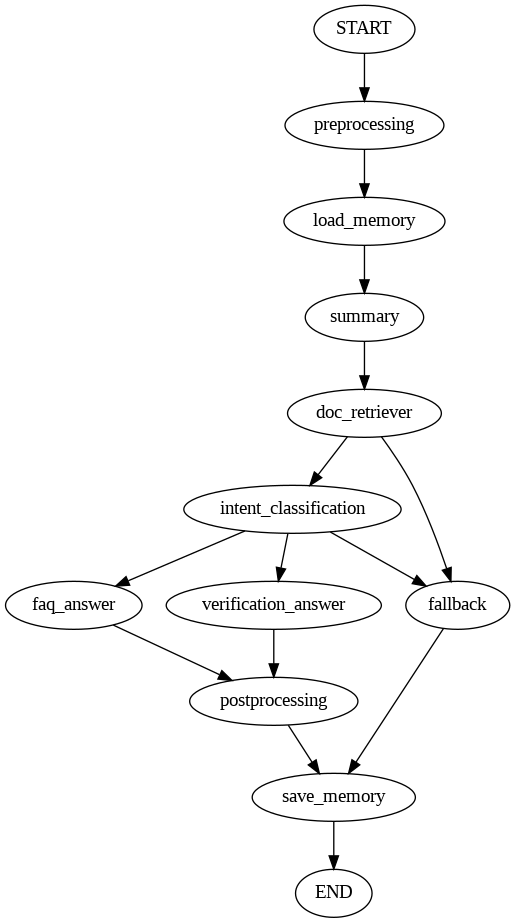

# Admission Chatbot

## Introduction

This is a chatbot designed to assist university admissions inquiries. It leverages RAG (Retrieval - Augmented Generation) with LangGraph to manage conversation flows, memory to maintain multi-turn context, and Weaviate for accurate data retrieval. The chatbot can answer questions about academic programs, admission requirements, tuition, and FAQs, providing reliable and context-aware responses.

## Features
- Context-Aware Answers: Remembers previous questions to provide context-sensitive responses.
- RAG Integration: Combines LLM with real documents for accurate answers.
- Memory Management: Supports multi-turn conversations for smooth interactions.
- Retriever (Weaviate): Finds semantically relevant documents for user queries.
- Conversation Flow (LangGraph): Routes questions to FAQ or Verification Answer nodes.
- Postprocessing & Summary: Refines answers and updates conversation summary.
- FAQ & Verification Support: Handles both standard FAQs and specific information verification.

## Workflow

The chatbot workflow is structured as a state graph using LangGraph, ensuring that user input is processed, routed, and responded to efficiently. The workflow consists of the following steps:
1. Preprocessing
    - Incoming user messages are cleaned, normalized, and prepared for downstream processing.
2. Load memory
    - Retrieves previous conversation history from the memory.
3. Summary
    - Generates or updates a conversation summary based on the loaded memory, helping the system understand ongoing topics.
4. Document Retrieval
    - Queries the Weaviate retriever to find semantically relevant documents based on the user's question.
5. Intent classification
    - Classifies the user's query into a specific intent to determine how it should be handled.
    - Helps generate high-quality prompts for the LLM by understanding the type of request.
6. Answer Nodes
    - Produces answers according to user intent, covering FAQs, verification requests, and fallback for unanswerable queries.
7. Postprocessing
    - Refines the generated answer.
8. Save memory
    - Updates the conversation memory with the new interaction.

    

